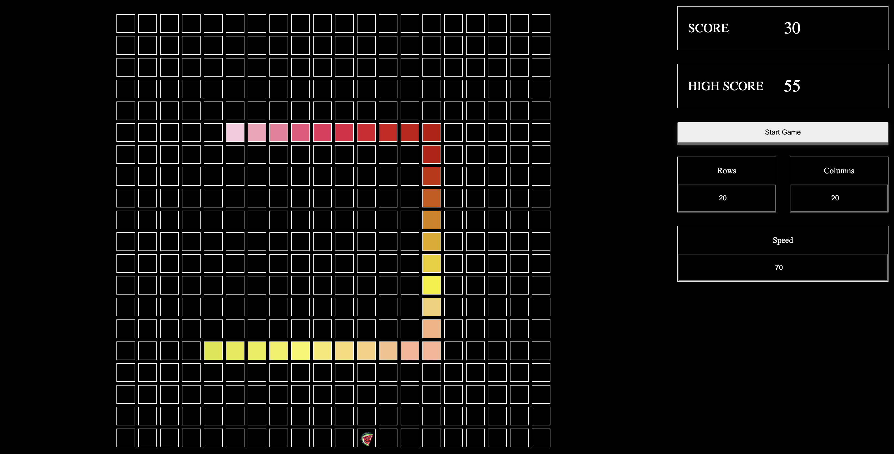

# snake

Just a classic snake game with customizable difficulty.

## Demo



## Installation Steps

1. Clone the repository:

```sh
git clone https://github.com/yourusername/snake.git
```

2. Navigate to the project directory:

```sh
cd snake
```

3. Install the dependencies:

```sh
npm install
```

4. Run the application:

```sh
npm run dev
```
